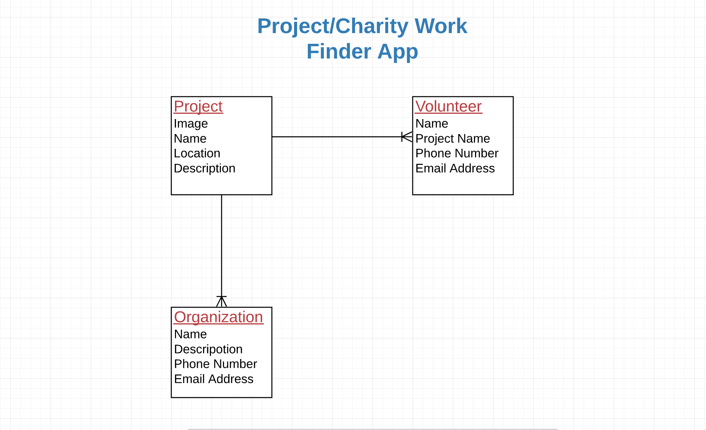
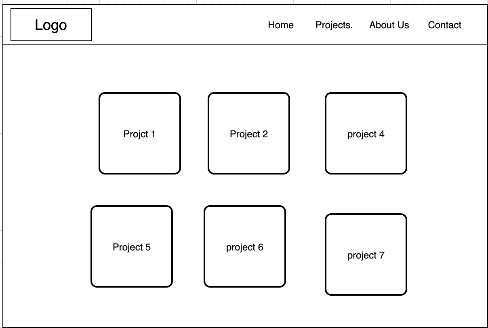
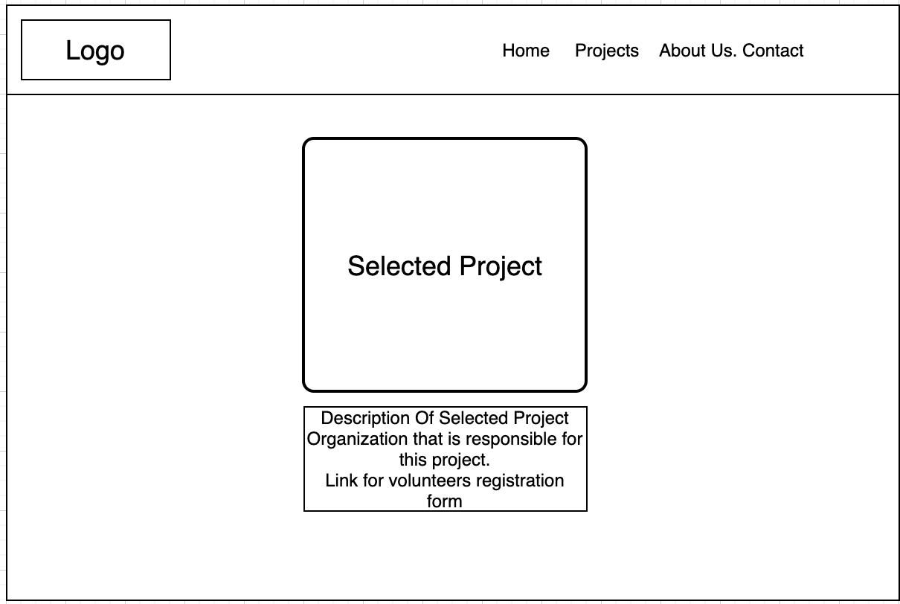
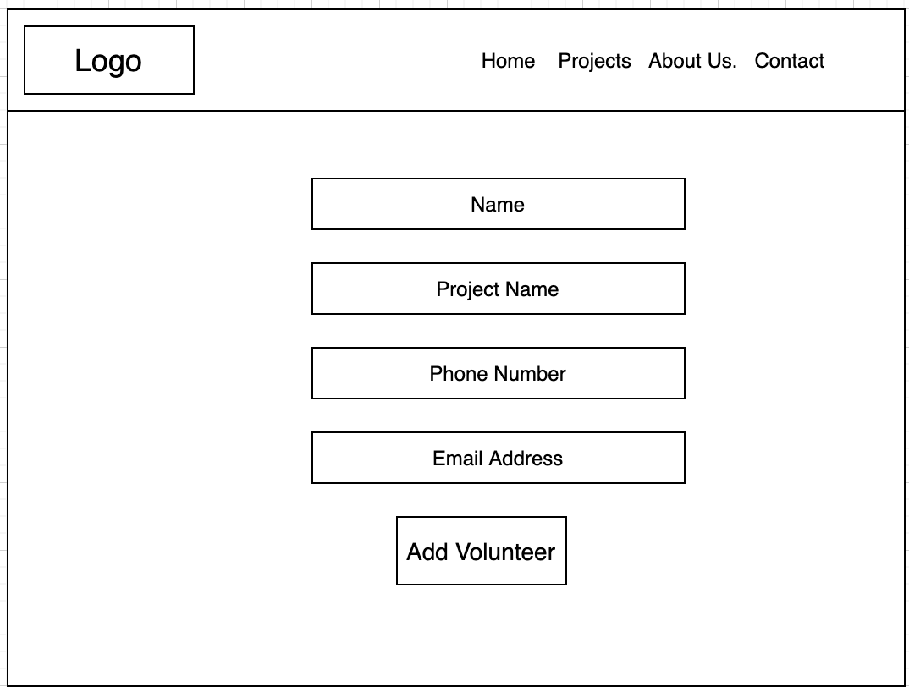
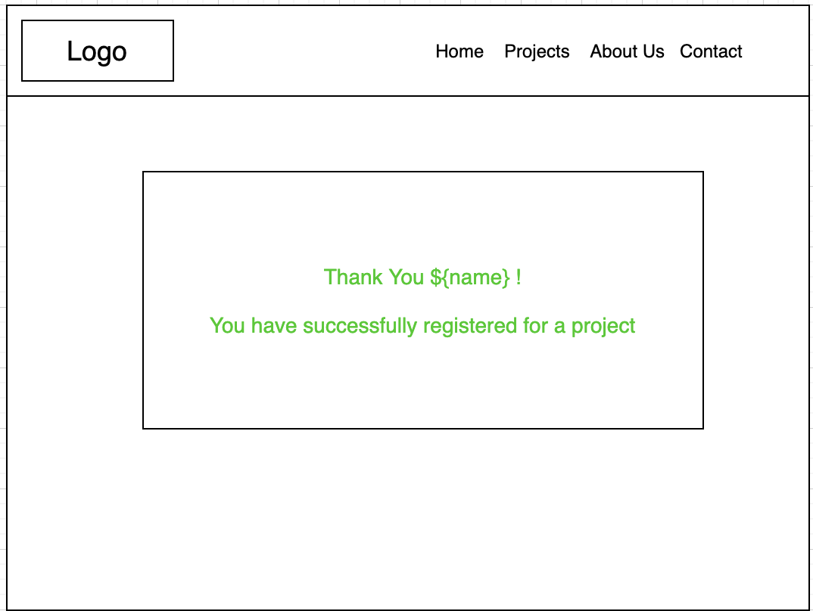

# Charity Work/project Finder App.
  There are many people in poverty who are struggling to receive basic human needs, however, it is not always easy to find those people and help them. You may fear that scammers will take your money and use it to satisfy thier drug or alcohol addiction. This app will connect you with trusted organizations that assure you that your donation will be contributed to the individuals who need it most.

# User Stories
* User can see different kinds of charity works that have the project name and locations.
* User can select a project and get detailed information about the project and the organization that is responsible to that specific project.
* User can communicate to the organization if the volunteer has more question.
* User can click on 'register' to sign up for a project.
* User can see a successfully submmited message.

# ERD 

# Wireframe

---

---

---

# publicly deployed app
Click [here](https://my-charity-app.herokuapp.com/) to see the app.
# Project Planning Board
click [here](https://github.com/sophiemar27/my-charity-app/projects/1) to see project planning board.

  